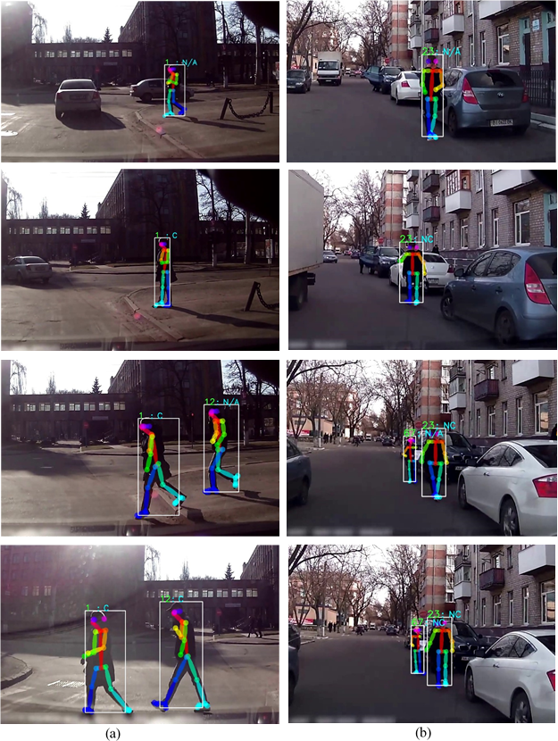

## Pedestrian Intention Prediction Using GCN
The objective here is to assist the development of pedestrian behavior analysis considering the pedestrian-vehicle interaction scenarios in the streets. Explicitly, analysis of visual data is considered for detecting and understanding pedestrian behavior at crossroads.

The very first component relates to the Human Pose Estimation (HPE) for detecting pedestrian body keypoints.OpenPose with 25 keypoints coordinates representing different parts of the pedestrian body is employed fro this purpose.

Human Pose Estimation is carried out using Openpose by https://github.com/CMU-Perceptual-Computing-Lab/openpose

The second component consist of pedestrian tracking using Deep-SORT. Deep SORT-based pedestrian tracking algorithm is implemented that uses a cosine metric learning process for acquainting feature space.

The third major component is a pedestrian intention prediction network based on Graph Convolution Network (GCN) and skeleton-based body keypoints. A 25x25 dimensional Adjacency matrix is constructed based on the 25 body keypoints and their connection among each other representing skeletal structure.A GCN-based intention prediction model is trained on the Joint Attention in Autonomous Driving (JAAD) dataset.

### Overall process for Pedestrian Intention Prediction

### Preview on cross-road scenario
(a) Crossing scenario  
(b) Not-crossing scenario  
 

